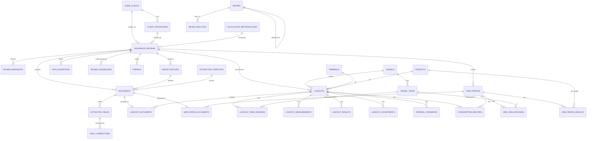

# Cargo Assurance Data Model

**TEAL Enterprise — Cargo Assurance Module**
Owning agent: Cargo Assurance Data-Model Agent
Status: Draft v1 — 2026-06-17

**Purpose.** This is the definitive column-level data model for the `cargo` Postgres schema. It expands every canonical table named in `_CARGO-SPEC.md` §6 into full detail — columns, types, foreign keys, key constraints, indexes — and specifies the enum types, the entity relationships, and the three structural mechanisms that make the module defensible: version pinning of procedures/methodologies onto a review, the document→loadout grouping that prevents double counting, and the three result layers that never overwrite raw evidence. Where the spec defers a modelling choice, the decision is made and justified here.

This document conforms to `_CARGO-SPEC.md` (the module spec) and `../_ARCHITECTURE-SPEC.md` (the platform spec). It is authoritative on the physical shape of the `cargo` schema. It cross-references the sibling Cargo Assurance docs by filename throughout: `cargo-ingestion-and-extraction.md`, `cargo-calculation-engine.md`, `cargo-security-and-multitenancy.md`, `cargo-dashboards-and-reporting.md`, and `cargo-ui-workflows.md`.

---

## 1. Scope, conventions, and the decisions this doc locks

The model exists to serve one shape of work described in `_CARGO-SPEC.md` §1: a **retrospective, batch analytical system**. Documents are uploaded in bulk at period end, loadouts are reconstructed automatically beneath a review, three result layers are computed, and the period is aggregated into findings and a published snapshot. The schema is therefore organised top-down around `cargo.assurance_reviews`, with everything else hanging beneath it.

Every table in this document inherits the platform conventions from `../_ARCHITECTURE-SPEC.md` §4 and `_CARGO-SPEC.md` §5 unless explicitly noted:

- **Primary key** `id uuid not null default gen_random_uuid()` (omitted from the per-column tables below to reduce noise; assume it on every table unless the table is a pure join table with a composite key).
- **Tenant scope** `company_id uuid not null references core.companies(id)` on every tenant table. Join/child tables carry `company_id` too (denormalised) so RLS policies are uniform and indexes are local — see §15.
- **Audit columns** `created_at timestamptz not null default now()`, `updated_at timestamptz` where the row mutates, `created_by uuid references core.users(id)`, `updated_by uuid references core.users(id)` where a user authored the change. Only the columns named in `_CARGO-SPEC.md` §6 for a given table are guaranteed; this doc adds `updated_at`/`updated_by` where the spec lists `updated_at` and the row is mutable.
- **Quantities** `numeric(20,4)` with an explicit `unit text` companion column. Money `numeric(20,4)`. We never store a quantity without its unit.
- **RLS** enabled on every table (`_CARGO-SPEC.md` §5, security doc authoritative).

### 1.1 Decision locked: native Postgres `enum` types in schema `cargo`

`../_ARCHITECTURE-SPEC.md` §4 defaults to native enums and the Accounting Engine doc locked them for accounting. We follow the same reasoning for `cargo`: the closed domains here (`document_type`, `measurement_method`, `tank_role`, `exception_type`, the result `layer`, the various lifecycle `status` sets) are genuinely fixed by the problem, are compared on hot read paths (aggregation scans every loadout result), and benefit from declaration-order sorting. They are implemented as native Postgres enum types in the `cargo` schema (§2).

**Open, company-extensible domains are reference tables, not enums:** `client_procedures`, `calculation_methodologies`, `extraction_templates`, `terminals`, `vessels`, `vessel_tanks`, `meters`, `products`. Those are data Taylor configures per client, not types.

### 1.2 Decision locked: derived data lives in views; snapshots and analytics are materialised rows

Following the GL precedent in `../_ARCHITECTURE-SPEC.md` §5, anything that is a pure function of base rows is a **view**, not a stored table, so it can never drift from the evidence. Where a number must be **frozen** (a published report) or is **expensive and read often** (period aggregates, per-meter bias), it is a materialised row that is always reconstructable from the base tables. §13 lists exactly what is stored vs derived.

---

## 2. Enum types

Implemented once as `create type cargo.<name> as enum (...)`. Declaration order is meaningful (lifecycle progression; severity ascending).

```sql
create type cargo.document_type as enum (
  'vessel_sounding_certificate','vessel_flow_meter_report','shore_flow_meter_report',
  'shore_tank_certificate','fueltrax_report','bunker_delivery_note','loadout_summary',
  'calibration_certificate','on_hire_certificate','off_hire_certificate','other');

create type cargo.measurement_method as enum (
  'vessel_sounding','vessel_meter','shore_meter','shore_tank','fueltrax','client_reported','other');

create type cargo.tank_role as enum (
  'receiving','non_receiving','day_service','settling','transfer','excluded');

create type cargo.exception_type as enum (
  'missing_reading','invalid_sequence','unit_mismatch','unknown_tank','unknown_meter',
  'missing_date','duplicate_certificate','unmatched_document','implausible_quantity',
  'undocumented_transfer','expired_calibration','low_confidence','indeterminate_formula');

-- result layers — the spine of the three-layer model (§11)
create type cargo.result_layer as enum ('raw_evidence','client_procedure','taylor_corrected');

-- lifecycle / status enums (named locally; values per _CARGO-SPEC.md §6)
create type cargo.config_status        as enum ('draft','active','archived');
create type cargo.review_status        as enum ('draft','in_review','reviewed','approved','published');
create type cargo.batch_status         as enum ('uploaded','processing','completed','failed','cancelled');
create type cargo.extraction_status    as enum ('pending','processing','extracted','needs_review','failed');
create type cargo.validation_status    as enum ('pending','valid','invalid','needs_review');
create type cargo.field_status         as enum ('ok','missing','uncertain','needs_review');
create type cargo.loadout_status       as enum ('extracted','needs_review','approved','excluded');
create type cargo.std_volume_basis     as enum ('none','at_15c','at_60f');
create type cargo.adjustment_type      as enum ('non_receiving_tank','consumption','internal_transfer',
                                               'temperature_density','meter_correction','other');
create type cargo.support_source       as enum ('fueltrax','engine_log','duration_rate',
                                               'client_approved','documented_transfer','none');
create type cargo.consumption_class    as enum ('documented','estimated','unsupported','unexplained');
create type cargo.hire_status          as enum ('extracted','needs_review','approved','excluded');
create type cargo.hire_boundary        as enum ('on_hire','off_hire');
create type cargo.hire_doc_role        as enum ('on_hire','off_hire','supporting');
create type cargo.exception_severity   as enum ('info','warning','error');
create type cargo.exception_status     as enum ('open','resolved','excluded');
create type cargo.finding_category     as enum ('procedural_effect','reconciliation_gap','directional_variance',
                                               'persistent_bias','measurement_inconsistency','calibration_concern',
                                               'explained_variance','unexplained_residual');
```

> `consumption_records.source` and `loadout_adjustments.supported_by` share the same evidence-source vocabulary; `consumption_records.source` uses `fueltrax,engine_log,duration_rate,client_approved,other` while `loadout_adjustments.supported_by` adds `documented_transfer` and `none`. They are kept as **two** enums (`support_source` for adjustments, a `consumption_source` enum for consumption) so each column's allowed set is exactly its domain:

```sql
create type cargo.consumption_source as enum ('fueltrax','engine_log','duration_rate','client_approved','other');
```

---

## 3. Configuration & reference tables

These are the company-configured, versioned templates and physical-asset registries. They are referenced *by version* from reviews and loadouts so history is reproducible.

### 3.1 `cargo.client_procedures` — versioned client reporting procedure

| Column | Type | Notes |
| --- | --- | --- |
| company_id | uuid not null → core.companies(id) | tenant |
| client_id | uuid not null → core.clients(id) | the client the procedure belongs to |
| name | text not null | e.g. "ExxonMobil Loadout Procedure" |
| version | int not null | monotonically increasing per (client_id) |
| status | cargo.config_status not null default 'draft' | draft → active → archived |
| config | jsonb not null default '{}' | general procedure config |
| required_documents | jsonb | document types the procedure expects per loadout |
| measurement_methods | jsonb | which methods are reported and their precedence |
| tolerances | jsonb | acceptable variance bands |
| terminology | jsonb | client-facing labels/relabelling |
| effective_from | date | when this version takes effect |
| created_by | uuid → core.users(id) | |
| created_at / updated_at | timestamptz | |

- **PK** `id`. **Unique** `(client_id, version)` — this pair *is* the pinnable version identity (`_CARGO-SPEC.md` §6).
- Partial unique `(client_id) where status='active'` is **not** imposed; multiple historical versions may remain queryable. Activation is managed by the config UI (`cargo-ui-workflows.md`).
- **FK** `client_id → core.clients(id)`. **Indexes**: `(company_id, client_id, status)`.
- No client-written code: `config`/`measurement_methods`/`tolerances` are **declarative** inputs to the versioned rules engine (`cargo-calculation-engine.md`), never executable code (`_CARGO-SPEC.md` §4.6).

### 3.2 `cargo.calculation_methodologies` — Taylor corrected methodology versions

| Column | Type | Notes |
| --- | --- | --- |
| company_id | uuid not null → core.companies(id) | |
| key | text not null | stable methodology key, e.g. `mass_balance_v` |
| name | text not null | |
| version | int not null | per (company_id, key) |
| description | text | |
| formula_rules | jsonb not null | declarative rules for the engine |
| status | cargo.config_status not null default 'draft' | |
| created_by | uuid → core.users(id) | |
| created_at | timestamptz | |

- **PK** `id`. **Unique** `(company_id, key, version)`. **Index** `(company_id, key, status)`.
- This is the **versioned rules engine config** (`_CARGO-SPEC.md` §4.6). A published review pins a specific `methodology_id` (§10).

### 3.3 `cargo.extraction_templates` — configurable extraction

| Column | Type | Notes |
| --- | --- | --- |
| company_id | uuid not null → core.companies(id) | |
| client_id | uuid null → core.clients(id) | null = generic template |
| document_type | cargo.document_type not null | which document kind this template parses |
| name | text not null | |
| version | int not null | |
| status | cargo.config_status not null default 'draft' | |
| field_map | jsonb not null | source location → field_key map |
| table_structures | jsonb | repeating-table layouts |
| unit_mappings | jsonb | source unit strings → canonical units |
| date_formats | jsonb | accepted date patterns |
| validation_rules | jsonb | per-field validation |
| confidence_thresholds | jsonb | needs_review cutoffs |
| created_by | uuid → core.users(id) | |
| created_at | timestamptz | |

- **PK** `id`. **Unique** `(company_id, coalesce(client_id,'00000000-...'), document_type, version)`. **Index** `(company_id, document_type, status)`. Drives `cargo-ingestion-and-extraction.md`.

### 3.4 `cargo.terminals`

| Column | Type | Notes |
| --- | --- | --- |
| company_id | uuid not null → core.companies(id) | |
| client_id | uuid null → core.clients(id) | null = shared terminal |
| name | text not null | |
| code | text | |
| location | text | |
| berths | jsonb | list of berth identifiers |
| is_active | bool not null default true | |
| created_at | timestamptz | |

- **PK** `id`. **Unique** `(company_id, code) where code is not null`. **Index** `(company_id, is_active)`.

### 3.5 `cargo.vessels`

| Column | Type | Notes |
| --- | --- | --- |
| company_id | uuid not null → core.companies(id) | |
| name | text not null | |
| imo | text | IMO number |
| default_client_id | uuid null → core.clients(id) | |
| is_active | bool not null default true | |
| created_at | timestamptz | |

- **PK** `id`. **Unique** `(company_id, imo) where imo is not null`. **Index** `(company_id, is_active)`.

### 3.6 `cargo.vessel_tanks`

| Column | Type | Notes |
| --- | --- | --- |
| company_id | uuid not null → core.companies(id) | |
| vessel_id | uuid not null → cargo.vessels(id) | |
| name | text not null | tank identifier on the vessel |
| default_role | cargo.tank_role not null default 'receiving' | per-loadout role may differ |
| capacity | numeric(20,4) | |
| unit | text | |
| is_active | bool not null default true | |

- **PK** `id`. **Unique** `(vessel_id, name)`. **Index** `(company_id, vessel_id)`.
- The **per-loadout role is stored on the reading**, not here (`loadout_tank_readings.tank_role`); `default_role` is only a seeding hint (`_CARGO-SPEC.md` §6).

### 3.7 `cargo.meters` — physical meters tracked independently for bias analytics

| Column | Type | Notes |
| --- | --- | --- |
| company_id | uuid not null → core.companies(id) | |
| meter_type | enum[vessel_flow,shore_flow] | implemented as `cargo.meter_type` |
| physical_id | text not null | serial / asset tag |
| name | text | |
| terminal_id | uuid null → cargo.terminals(id) | for shore meters |
| vessel_id | uuid null → cargo.vessels(id) | for vessel meters |
| calibration_factor | numeric | |
| calibration_date | date | |
| replaced_by_meter_id | uuid null → cargo.meters(id) | self-FK; replacement chain |
| is_active | bool not null default true | |
| created_at | timestamptz | |

- Add `create type cargo.meter_type as enum ('vessel_flow','shore_flow');`
- **PK** `id`. **Unique** `(company_id, physical_id)`. **Index** `(company_id, meter_type, is_active)`.
- Tracking the **physical** meter (not a per-document meter name) is what makes `cargo.meter_analytics` per-meter bias possible (§12).

### 3.8 `cargo.products`

| Column | Type | Notes |
| --- | --- | --- |
| company_id | uuid not null → core.companies(id) | |
| name | text not null | |
| grade | text | |
| default_density | numeric | |
| default_api | numeric | |
| is_active | bool not null default true | |

- **PK** `id`. **Unique** `(company_id, name)`. Defaults are **fallbacks only** — never substituted silently for a measured value (`_CARGO-SPEC.md` §4.2).

---

## 4. Reviews

### 4.1 `cargo.assurance_reviews` — the top-level record

| Column | Type | Notes |
| --- | --- | --- |
| company_id | uuid not null → core.companies(id) | |
| client_id | uuid not null → core.clients(id) | |
| title | text not null | |
| start_date / end_date | date not null | review period |
| reporting_currency | char(3) null → accounting.currencies(code) | optional financial exposure (`_CARGO-SPEC.md` §8) |
| procedure_id | uuid not null → cargo.client_procedures(id) | **pinned** version (§10) |
| methodology_id | uuid not null → cargo.calculation_methodologies(id) | **pinned** version (§10) |
| included_terminals | uuid[] | scope filter |
| included_vessels | uuid[] | scope filter |
| included_products | uuid[] | scope filter |
| status | cargo.review_status not null default 'draft' | draft→in_review→reviewed→approved→published |
| notes | text | |
| created_by / updated_by | uuid → core.users(id) | |
| created_at / updated_at | timestamptz | |
| approved_by / published_by | uuid → core.users(id) | |
| approved_at / published_at | timestamptz | |

- **PK** `id`. **FK** `procedure_id`, `methodology_id` reference the **specific versioned rows** (§10). **Indexes**: `(company_id, client_id, status)`, `(company_id, start_date, end_date)`.
- A **CHECK** `end_date >= start_date`. A review may only move to `published` after it has at least one `cargo.review_snapshots` row (enforced in the publish function, `cargo-dashboards-and-reporting.md`).

### 4.2 `cargo.review_snapshots` — reproducible published snapshot

| Column | Type | Notes |
| --- | --- | --- |
| review_id | uuid not null → cargo.assurance_reviews(id) | |
| company_id | uuid not null → core.companies(id) | |
| version | int not null | per review |
| snapshot | jsonb not null | full frozen result set: results, aggregates, findings, pinned versions |
| report_pdf_path | text | Supabase Storage path |
| report_xlsx_path | text | |
| created_by | uuid → core.users(id) | |
| created_at | timestamptz | |

- **PK** `id`. **Unique** `(review_id, version)`. **Index** `(company_id, review_id)`.
- **Immutable once written.** A later correction creates a **new version**, never an edit (`_CARGO-SPEC.md` §4.7). Client users read **only** the latest published snapshot for their `client_id` (`cargo-security-and-multitenancy.md`).

---

## 5. Ingestion

### 5.1 `cargo.import_batches`

| Column | Type | Notes |
| --- | --- | --- |
| company_id | uuid not null → core.companies(id) | |
| review_id | uuid not null → cargo.assurance_reviews(id) | |
| status | cargo.batch_status not null default 'uploaded' | |
| file_count / processed_count / failed_count | int not null default 0 | |
| created_by | uuid → core.users(id) | |
| created_at / updated_at | timestamptz | |

- **PK** `id`. **Index** `(company_id, review_id, status)`.

### 5.2 `cargo.documents` — authoritative ingestion record, **never deleted**

| Column | Type | Notes |
| --- | --- | --- |
| company_id | uuid not null → core.companies(id) | |
| review_id | uuid not null → cargo.assurance_reviews(id) | |
| batch_id | uuid not null → cargo.import_batches(id) | |
| client_id | uuid not null → core.clients(id) | |
| original_filename | text not null | never lost (`_CARGO-SPEC.md` §4.1) |
| checksum | text not null | duplicate detection |
| file_type | text | |
| storage_path | text not null | Supabase Storage |
| page_count | int | |
| uploaded_by | uuid → core.users(id) | |
| uploaded_at | timestamptz | |
| detected_document_type | cargo.document_type | classifier output |
| classification_confidence | numeric | |
| extraction_status | cargo.extraction_status not null default 'pending' | |
| extraction_confidence | numeric | |
| raw_extraction | jsonb | exactly what was read |
| normalized_extraction | jsonb | canonicalised values |
| validation_status | cargo.validation_status not null default 'pending' | |
| parent_archive_id | uuid null → cargo.documents(id) | self-FK; file extracted from a zip/archive |
| created_at | timestamptz | |

- **PK** `id`. **Unique** `(company_id, checksum)` to surface duplicates (raised as a `duplicate_certificate` exception rather than blocking — see §8). **Indexes**: `(company_id, review_id, extraction_status)`, `(batch_id)`, `(company_id, detected_document_type)`.
- **No `deleted_at`.** Documents are never removed (`_CARGO-SPEC.md` §4.1); exclusion happens at the loadout level. May also register a `core.documents` row with `owner_module='cargo_assurance'` (`_CARGO-SPEC.md` §5).

### 5.3 `cargo.extracted_fields` — one row per extracted value, source-traceable

| Column | Type | Notes |
| --- | --- | --- |
| company_id | uuid not null → core.companies(id) | |
| document_id | uuid not null → cargo.documents(id) | |
| field_key | text not null | canonical field name |
| raw_value | text | as read |
| normalized_value | text | canonicalised |
| unit | text | |
| confidence | numeric | |
| source_page | int | traceability (`_CARGO-SPEC.md` §4.3) |
| source_table | text | |
| source_cell | text | |
| source_worksheet | text | |
| status | cargo.field_status not null default 'ok' | ok/missing/uncertain/needs_review |
| created_at | timestamptz | |

- **PK** `id`. **Index** `(company_id, document_id, field_key)`. Every field carries its **page/table/cell/worksheet** so a number is always traceable to its origin.

### 5.4 `cargo.field_corrections` — preserve original + corrected

| Column | Type | Notes |
| --- | --- | --- |
| company_id | uuid not null → core.companies(id) | |
| extracted_field_id | uuid not null → cargo.extracted_fields(id) | |
| original_value | text not null | what was extracted |
| corrected_value | text not null | analyst's correction |
| reason | text | |
| corrected_by | uuid → core.users(id) | |
| corrected_at | timestamptz | |

- **PK** `id`. **Index** `(company_id, extracted_field_id)`. Append-only history; never overwrites the field, never silently alters an approved review (`_CARGO-SPEC.md` §4.7). The "current value" of a field is its latest correction or, absent one, its `normalized_value` — exposed via a view (§13).

---

## 6. Loadouts & measurements

### 6.1 `cargo.loadouts` — reconstructed automatically beneath a review

| Column | Type | Notes |
| --- | --- | --- |
| company_id | uuid not null → core.companies(id) | |
| review_id | uuid not null → cargo.assurance_reviews(id) | |
| client_id | uuid not null → core.clients(id) | |
| vessel_id | uuid null → cargo.vessels(id) | |
| terminal_id | uuid null → cargo.terminals(id) | |
| berth | text | |
| certificate_number | text | |
| loadout_date | date | |
| start_time / completion_time | timestamptz | |
| product_id | uuid null → cargo.products(id) | |
| nominated_quantity | numeric(20,4) | |
| reported_delivered_quantity | numeric(20,4) | |
| unit | text | |
| match_confidence | numeric | reconstruction confidence |
| status | cargo.loadout_status not null default 'extracted' | extracted/needs_review/approved/excluded |
| exclusion_reason | text | required when status='excluded' |
| created_by / updated_by | uuid → core.users(id) | |
| created_at / updated_at | timestamptz | |

- **PK** `id`. **Indexes**: `(company_id, review_id, status)`, `(company_id, vessel_id, loadout_date)`, `(company_id, certificate_number)`.
- **CHECK** `status <> 'excluded' or exclusion_reason is not null`. Excluded loadouts remain stored (evidence preserved) but are dropped from aggregation (§12).

### 6.2 `cargo.loadout_documents` — the grouping that prevents double counting

| Column | Type | Notes |
| --- | --- | --- |
| loadout_id | uuid not null → cargo.loadouts(id) | |
| document_id | uuid not null → cargo.documents(id) | **unique** |
| company_id | uuid not null → core.companies(id) | |
| role | text | role of the doc in this loadout (e.g. sounding, shore meter) |

- **PK** `(loadout_id, document_id)`. **Critical constraint: `unique (document_id)`** — a document maps to **at most one loadout**, so the same certificate can never be counted in two loadouts (`_CARGO-SPEC.md` §6, §1 batch-analysis integrity). See §9.
- **Index** `(company_id, loadout_id)`.

### 6.3 `cargo.loadout_tank_readings`

| Column | Type | Notes |
| --- | --- | --- |
| company_id | uuid not null → core.companies(id) | |
| loadout_id | uuid not null → cargo.loadouts(id) | |
| vessel_tank_id | uuid null → cargo.vessel_tanks(id) | |
| tank_role | cargo.tank_role not null | per-loadout role (overrides tank default) |
| received_flag | bool | did this tank receive product |
| opening_sounding / closing_sounding | numeric | |
| opening_quantity / closing_quantity | numeric(20,4) | |
| unit | text | |
| temperature | numeric | |
| density | numeric | |
| api_gravity | numeric | |
| std_volume_basis | cargo.std_volume_basis not null default 'none' | none/at_15c/at_60f |
| raw_difference | numeric(20,4) | evidence — preserved always |
| corrected_receipt_difference | numeric(20,4) | 0 for non-receiving tank unless documented transfer |
| procedural_effect | numeric(20,4) | raw_difference − corrected_receipt_difference delta |
| explanation | text | |
| source_document_id | uuid null → cargo.documents(id) | traceability |
| confidence | numeric | |

- **PK** `id`. **Indexes**: `(company_id, loadout_id)`, `(vessel_tank_id)`.
- Encodes the **non-receiving-tank invariant** (`_CARGO-SPEC.md` §7): `raw_difference` is kept as evidence; `corrected_receipt_difference = 0` for a `non_receiving` tank unless a documented `cargo.internal_transfers` row exists; the delta becomes `procedural_effect` and is aggregated.

### 6.4 `cargo.loadout_measurements` — one row per measurement method

| Column | Type | Notes |
| --- | --- | --- |
| company_id | uuid not null → core.companies(id) | |
| loadout_id | uuid not null → cargo.loadouts(id) | |
| method | cargo.measurement_method not null | vessel_sounding/vessel_meter/shore_meter/… |
| raw_values | jsonb | as read |
| normalized_values | jsonb | converted |
| calculated_quantity | numeric(20,4) | |
| original_unit / converted_unit | text | preserve both (`_CARGO-SPEC.md` §7) |
| formula | text | |
| formula_version | text | which rule produced it |
| source_document_id | uuid null → cargo.documents(id) | |
| confidence | numeric | |
| included | bool not null default true | included in comparison |
| exclusion_reason | text | |

- **PK** `id`. **Unique** `(loadout_id, method)`. **Index** `(company_id, loadout_id)`.
- The set of methods per loadout is the input to the method-comparison and variance logic in `cargo-calculation-engine.md`.

### 6.5 `cargo.loadout_results` — the three result layers

| Column | Type | Notes |
| --- | --- | --- |
| company_id | uuid not null → core.companies(id) | |
| loadout_id | uuid not null → cargo.loadouts(id) | |
| layer | cargo.result_layer not null | raw_evidence / client_procedure / taylor_corrected |
| quantity | numeric(20,4) | |
| unit | text | |
| basis | text | reference basis (e.g. std volume @15°C) |
| details | jsonb | breakdown, references to contributing measurements |
| methodology_version | text | which pinned methodology/procedure version produced it |
| created_at | timestamptz | |

- **PK** `id`. **Unique** `(loadout_id, layer)` — exactly one row per layer per loadout. **Index** `(company_id, loadout_id, layer)`.
- This is the structural home of the three-layer model (§11). `raw_evidence` is never recomputed from the others; each layer is written independently from the appropriate source.

### 6.6 `cargo.loadout_adjustments` — drift waterfall components

| Column | Type | Notes |
| --- | --- | --- |
| company_id | uuid not null → core.companies(id) | |
| loadout_id | uuid not null → cargo.loadouts(id) | |
| type | cargo.adjustment_type not null | non_receiving_tank/consumption/internal_transfer/temperature_density/meter_correction/other |
| quantity | numeric(20,4) | |
| supported_by | cargo.support_source not null default 'none' | evidence class |
| evidence_document_id | uuid null → cargo.documents(id) | |
| explanation | text | |
| created_at | timestamptz | |

- **PK** `id`. **Index** `(company_id, loadout_id, type)`. These rows are the waterfall steps between layers (raw → corrected), each justified by an evidence class.

### 6.7 `cargo.internal_transfers` — net to zero across affected tanks

| Column | Type | Notes |
| --- | --- | --- |
| company_id | uuid not null → core.companies(id) | |
| loadout_id | uuid not null → cargo.loadouts(id) | |
| from_tank_id / to_tank_id | uuid → cargo.vessel_tanks(id) | |
| quantity | numeric(20,4) | |
| unit | text | |
| source_document_id | uuid null → cargo.documents(id) | |
| matched | bool not null default false | whether the transfer reconciles |

- **PK** `id`. **CHECK** `from_tank_id <> to_tank_id`. **Index** `(company_id, loadout_id)`. The "internal transfers net to zero" invariant (`_CARGO-SPEC.md` §7) is verified by the engine, surfaced as an `undocumented_transfer` exception when it fails.

### 6.8 `cargo.consumption_records` — never present estimate as measured

| Column | Type | Notes |
| --- | --- | --- |
| company_id | uuid not null → core.companies(id) | |
| loadout_id | uuid null → cargo.loadouts(id) | one of loadout/hire scope |
| hire_period_id | uuid null → cargo.hire_periods(id) | |
| classification | cargo.consumption_class not null | documented/estimated/unsupported/unexplained |
| quantity | numeric(20,4) | |
| unit | text | |
| source | cargo.consumption_source not null | fueltrax/engine_log/duration_rate/client_approved/other |
| evidence_document_id | uuid null → cargo.documents(id) | |
| explanation | text | |

- **PK** `id`. **CHECK** `(loadout_id is not null) <> (hire_period_id is not null)` — exactly one scope. **Index** `(company_id, loadout_id)`, `(company_id, hire_period_id)`.
- `classification` keeps estimated/unsupported consumption visibly distinct from documented (`_CARGO-SPEC.md` §4.2, §7 day/service-tank rule).

---

## 7. Hire periods (on-hire / off-hire reconciliation)

Hire periods use the **same** upload/extraction/tracing/validation/approval/versioning workflow as loadouts (`_CARGO-SPEC.md` §9), and mirror the loadout grouping pattern.

### 7.1 `cargo.hire_periods`

| Column | Type | Notes |
| --- | --- | --- |
| company_id | uuid not null → core.companies(id) | |
| review_id | uuid null → cargo.assurance_reviews(id) | optional review scope |
| client_id | uuid not null → core.clients(id) | |
| vessel_id | uuid not null → cargo.vessels(id) | |
| charterer_client_id | uuid null → core.clients(id) | counterparty |
| on_hire_date / off_hire_date | date | |
| on_hire_time / off_hire_time | time | |
| on_hire_location / off_hire_location | text | |
| status | cargo.hire_status not null default 'extracted' | |
| created_by | uuid → core.users(id) | |
| created_at | timestamptz | |

- **PK** `id`. **Indexes**: `(company_id, vessel_id, on_hire_date)`, `(company_id, review_id)`.

### 7.2 `cargo.hire_period_documents`

| Column | Type | Notes |
| --- | --- | --- |
| hire_period_id | uuid not null → cargo.hire_periods(id) | |
| document_id | uuid not null → cargo.documents(id) | **unique** |
| company_id | uuid not null → core.companies(id) | |
| role | cargo.hire_doc_role not null | on_hire/off_hire/supporting |

- **PK** `(hire_period_id, document_id)`. **Unique `(document_id)`** — same anti-double-counting rule as loadouts (§9).

### 7.3 `cargo.hire_tank_readings`

| Column | Type | Notes |
| --- | --- | --- |
| company_id | uuid not null → core.companies(id) | |
| hire_period_id | uuid not null → cargo.hire_periods(id) | |
| boundary | cargo.hire_boundary not null | on_hire/off_hire |
| vessel_tank_id | uuid null → cargo.vessel_tanks(id) | |
| product_id | uuid null → cargo.products(id) | |
| sounding | numeric | |
| quantity | numeric(20,4) | |
| unit | text | |
| temperature / density / api_gravity | numeric | |
| std_volume | numeric(20,4) | |

- **PK** `id`. **Index** `(company_id, hire_period_id, boundary)`.

### 7.4 `cargo.hire_period_results` — per fuel grade

| Column | Type | Notes |
| --- | --- | --- |
| company_id | uuid not null → core.companies(id) | |
| hire_period_id | uuid not null → cargo.hire_periods(id) | |
| product_id | uuid not null → cargo.products(id) | per grade |
| on_hire_rob | numeric(20,4) | remaining-on-board at on-hire |
| fuel_received | numeric(20,4) | |
| verified_consumption | numeric(20,4) | |
| external_discharged | numeric(20,4) | |
| other_adjustments | numeric(20,4) | |
| expected_off_hire_rob | numeric(20,4) | = on_hire_rob + received − consumption − discharged + adjustments |
| actual_off_hire_rob | numeric(20,4) | |
| variance | numeric(20,4) | actual − expected |
| unexplained_residual | numeric(20,4) | |
| unit | text | |
| data_quality | jsonb | completeness flags |
| created_at | timestamptz | |

- **PK** `id`. **Unique** `(hire_period_id, product_id)`. Implements the hire mass-balance identity in `_CARGO-SPEC.md` §7. When consumption/transfer evidence is missing, only the verified on-hire→off-hire change is reported; no loss is inferred (the engine sets `verified_consumption`/`unexplained_residual` accordingly and flags `data_quality`).

---

## 8. Exceptions, analytics, findings

### 8.1 `cargo.data_exceptions` — the exception queue

| Column | Type | Notes |
| --- | --- | --- |
| company_id | uuid not null → core.companies(id) | |
| review_id | uuid not null → cargo.assurance_reviews(id) | |
| loadout_id | uuid null → cargo.loadouts(id) | |
| hire_period_id | uuid null → cargo.hire_periods(id) | |
| document_id | uuid null → cargo.documents(id) | |
| type | cargo.exception_type not null | |
| severity | cargo.exception_severity not null | info/warning/error |
| message | text not null | |
| status | cargo.exception_status not null default 'open' | open/resolved/excluded |
| resolved_by | uuid → core.users(id) | |
| resolved_at | timestamptz | |
| resolution_note | text | |
| created_at | timestamptz | |

- **PK** `id`. **Indexes**: `(company_id, review_id, status, severity)`, `(loadout_id)`, `(document_id)`. The `duplicate_certificate` exception is raised when the `documents` checksum unique constraint catches a re-upload.

### 8.2 `cargo.review_aggregates` — period-level totals snapshot (also exposed via views)

| Column | Type | Notes |
| --- | --- | --- |
| review_id | uuid not null → cargo.assurance_reviews(id) | |
| company_id | uuid not null → core.companies(id) | |
| computed_at | timestamptz not null default now() | |
| metrics | jsonb not null | period totals: by layer, by method, drift waterfall, counts |

- **PK** `id`. **Index** `(company_id, review_id)`. A **materialised convenience row** — always reconstructable from `loadout_results`/`loadout_adjustments`; a live `cargo.v_review_aggregates` view computes the same numbers on demand (§13).

### 8.3 `cargo.meter_analytics` — per physical meter bias

| Column | Type | Notes |
| --- | --- | --- |
| company_id | uuid not null → core.companies(id) | |
| meter_id | uuid not null → cargo.meters(id) | physical meter |
| review_id | uuid null → cargo.assurance_reviews(id) | null = cross-review/all-time |
| loadout_count | int | |
| total_volume | numeric(20,4) | |
| mean_variance_pct / median_variance_pct / weighted_variance_pct | numeric | percentages never summed (`_CARGO-SPEC.md` §7) |
| stddev | numeric | |
| cumulative_variance | numeric(20,4) | computed from quantities, not summed % |
| same_direction_pct | numeric | persistence of directional bias |
| computed_at | timestamptz | |

- **PK** `id`. **Unique** `(company_id, meter_id, coalesce(review_id,'00000000-...'))`. Per-physical-meter aggregation is the basis for `calibration_concern` / `persistent_bias` findings.

### 8.4 `cargo.findings` — neutral, defensible findings

| Column | Type | Notes |
| --- | --- | --- |
| company_id | uuid not null → core.companies(id) | |
| review_id | uuid not null → cargo.assurance_reviews(id) | |
| category | cargo.finding_category not null | procedural_effect/reconciliation_gap/… |
| title | text not null | |
| statement | text not null | neutral language (`_CARGO-SPEC.md` §4.9) |
| supporting_record_ids | jsonb | links to loadouts/results/documents |
| sample_size | int | below configured minimum ⇒ no strong-trend conclusion |
| comparison_method / reference_method | text | |
| absolute_variance | numeric(20,4) | |
| variance_pct | numeric | |
| tolerance | numeric | |
| data_quality_notes | text | |
| severity | cargo.exception_severity | reuse info/warning/error |
| status | cargo.exception_status | reuse open/resolved/excluded |
| created_at | timestamptz | |

- **PK** `id`. **Index** `(company_id, review_id, category)`. A finding never alleges theft/fraud/tampering and never asserts a strong trend below the configurable minimum `sample_size` (`_CARGO-SPEC.md` §4.9).

---

## 9. Document → loadout grouping (preventing double counting)

The integrity of every period total depends on one rule: **a document contributes to at most one loadout (or one hire period), never two.** This is enforced *physically*, not in application logic:

- `cargo.loadout_documents` has `unique (document_id)`.
- `cargo.hire_period_documents` has `unique (document_id)`.
- A document may legitimately belong to a loadout **or** a hire period **or** neither (unmatched). It can never be in two loadouts; the unique constraint makes a second `insert` fail. A genuinely re-used certificate is instead modelled as a single grouping plus references.

```sql
create table cargo.loadout_documents (
  loadout_id  uuid not null references cargo.loadouts(id),
  document_id uuid not null references cargo.documents(id),
  company_id  uuid not null references core.companies(id),
  role        text,
  primary key (loadout_id, document_id),
  unique (document_id)               -- ⬅ one loadout per document
);
```

Consequences:

- **Reconstruction** (`cargo-ingestion-and-extraction.md`) groups documents into loadouts by matching certificate number / vessel / date / terminal; the grouping is recorded here exactly once.
- A document the matcher cannot place stays **unmatched** and raises an `unmatched_document` exception — it is visible, never silently dropped and never double-attributed.
- Period aggregation (§12) sums over **loadouts**, and each loadout's evidence is a disjoint set of documents, so no certificate is counted twice.

---

## 10. Version pinning of procedure & methodology on a review

`_CARGO-SPEC.md` §4.5 requires that *historical reviews keep the template/methodology version used when calculated.* The model pins versions by **referencing the specific versioned row**, not the logical template:

- `cargo.client_procedures` identity is `(client_id, version)` (unique). A review stores `procedure_id` pointing at **one** such row.
- `cargo.calculation_methodologies` identity is `(company_id, key, version)` (unique). A review stores `methodology_id` pointing at one row.
- Because each version is a distinct, immutable-after-activation row, a new procedure version creates a **new row** (new `id`); existing reviews keep pointing at the old `id`. Their results are unaffected.
- `cargo.loadout_results.methodology_version` and `cargo.loadout_measurements.formula_version` additionally **stamp the version string** into the result, so even if a row were re-derived the provenance is explicit.
- The published `cargo.review_snapshots.snapshot` jsonb embeds the pinned procedure and methodology config verbatim, so a snapshot is reproducible even if the source config tables later change. This is the same "freeze the inputs" discipline the accounting engine applies to fx rates.

Result: re-running a review with today's procedure is a deliberate act (re-point `procedure_id`/`methodology_id`, recompute, new snapshot version) — it can never happen by accident.

---

## 11. The three result layers (never overwrite raw evidence)

`_CARGO-SPEC.md` §4.4 mandates three layers that coexist:

| Layer (`cargo.result_layer`) | Meaning | Source |
| --- | --- | --- |
| `raw_evidence` | What certificates/reports actually recorded | `loadout_measurements` (as-read), tank readings' `raw_difference` |
| `client_procedure` | Client's configured reporting methodology | pinned `client_procedures` version applied by the engine |
| `taylor_corrected` | Taylor's defensible receipt/mass-balance result | pinned `calculation_methodologies` version + `loadout_adjustments` |

Representation:

- `cargo.loadout_results` holds **exactly one row per layer per loadout** (`unique (loadout_id, layer)`). The three rows coexist; computing the corrected layer never updates the raw row.
- The deltas **between** layers are explicit, not implied: `loadout_tank_readings.procedural_effect` (raw vs corrected), and the `loadout_adjustments` waterfall (each step justified by `supported_by`).
- The spec's derived quantities are computed from these rows and exposed as views (§13):
  - *Claimed-over-received* = shore reported − `taylor_corrected`.
  - *Procedural apparent loss* = `taylor_corrected` − `client_procedure`.
  - *Unexplained residual* = `taylor_corrected` − selected independent reference method (from `loadout_measurements`).
- Because `raw_evidence` is written once from the source documents and never recomputed, the audit trail always preserves "what the paper said" independently of any methodology.

---

## 12. Derivation: stored aggregates vs views

Aggregation sums over **non-excluded loadouts** within a review's scope (`included_terminals/vessels/products`). Period numbers exist in two forms:

- **Live views** (`cargo.v_review_aggregates`, `cargo.v_loadout_variance`, `cargo.v_field_current`) always reflect the current base rows — the reconciliation oracle.
- **Materialised rows** (`cargo.review_aggregates`, `cargo.meter_analytics`) cache expensive cross-period computations for dashboards, and are frozen verbatim into `cargo.review_snapshots` at publish. They are always reconstructable; if they ever disagree with the view, the view wins and the cache is rebuilt.

Percentages are **never summed**: cumulative variance is computed from aggregated quantities or correctly weighted averages (`_CARGO-SPEC.md` §7), which is why `meter_analytics` stores both `cumulative_variance` (quantity) and `weighted_variance_pct` (re-derived), not a running sum of per-loadout percentages.

---

## 13. What is stored vs derived (summary)

| Concern | Form | Where |
| --- | --- | --- |
| Original documents, extracted fields, corrections | **stored**, append-only | `documents`, `extracted_fields`, `field_corrections` |
| Current value of a field (latest correction else normalized) | **view** | `cargo.v_field_current` |
| Loadout reconstruction & measurements | **stored** | `loadouts`, `loadout_*` |
| Three result layers | **stored**, one row per layer | `loadout_results` |
| Inter-layer variances (claimed-over-received, procedural loss, residual) | **view** | `cargo.v_loadout_variance` |
| Period totals | **view** + cached row | `cargo.v_review_aggregates` / `review_aggregates` |
| Per-meter bias | cached row (reconstructable) | `meter_analytics` |
| Findings | **stored** (human-curated + engine-proposed) | `findings` |
| Published report | **frozen snapshot** | `review_snapshots` (immutable; new version on change) |

---

## 14. Entity-relationship diagram



---

## Open Questions

- **`review_aggregates` / `meter_analytics` refresh cadence.** Recompute on every result write, on demand, or via a scheduled job (mirroring the accounting `account_balances` reconcile job)? Affects dashboard latency vs write cost.
- **Cross-review meter analytics.** Should all-time per-meter bias (`review_id is null`) be a maintained row, or always a view? It spans tenants' historical reviews and may be large.
- **`loadout_documents.role`** is free `text`; should it be promoted to an enum once the set of roles stabilises across the extraction pipeline?
- **Re-used documents.** Is a single certificate ever legitimately shared by two loadouts (e.g. a combined shore meter report covering two deliveries)? If so the `unique(document_id)` rule needs a splitting model (one synthetic per-loadout document slice) — currently assumed not needed for v1.
- **Field "current value" view performance.** `cargo.v_field_current` resolves latest correction per field; at hundreds of documents per review this may need a maintained `current_value` column on `extracted_fields` instead.
- **`consumption_records` scope FK to hire.** A consumption row references either a loadout or a hire period; should there also be a review-level (vessel-period) consumption not tied to a single loadout?

## Decisions Locked

- **Native Postgres `enum` types** for all closed `cargo` domains; **reference tables** for company-extensible config (procedures, methodologies, templates, terminals, vessels, tanks, meters, products). (§1.1, §2)
- **Version pinning by FK to the specific versioned row** (`procedure_id`, `methodology_id`) plus version stamps on results and verbatim config in the snapshot; new versions are new rows, never edits. (§10)
- **One document → at most one loadout/hire period**, enforced by `unique (document_id)` on `loadout_documents` and `hire_period_documents`; unmatched documents raise an exception, never silently dropped. (§9)
- **Three result layers as distinct rows** in `loadout_results` (`unique (loadout_id, layer)`); `raw_evidence` is written once and never recomputed; inter-layer variances are views. (§11)
- **Documents are never deleted** (`no deleted_at`); exclusion is modelled at the loadout/exception level, evidence always preserved. (§5.2)
- **Derived data is a view; frozen/expensive data is a reconstructable cached row**; published reports are immutable snapshots, a correction creates a new version. (§1.2, §12, §13)
- **Quantities are `numeric(20,4)` + explicit `unit`**, raw and converted values preserved separately; **percentages are never summed**. (§1, §12)
- Every tenant/child table carries `company_id` for uniform RLS; RLS reuses `core.user_companies()` / `core.has_permission()` plus client-portal policies (authoritative in `cargo-security-and-multitenancy.md`). (§1, §15-by-reference)

---

*Cross-references:* `_CARGO-SPEC.md` (authoritative module spec — canonical names §6, principles §4, invariants §7), `../_ARCHITECTURE-SPEC.md` (platform conventions §4, RBAC §7). Sibling Cargo Assurance docs: `cargo-ingestion-and-extraction.md` (classification, extraction, loadout reconstruction), `cargo-calculation-engine.md` (versioned rules engine, method comparison, variance), `cargo-security-and-multitenancy.md` (RLS, client-portal isolation), `cargo-dashboards-and-reporting.md` (aggregates, snapshots, publish), `cargo-ui-workflows.md` (review lifecycle, data-review workspace).
