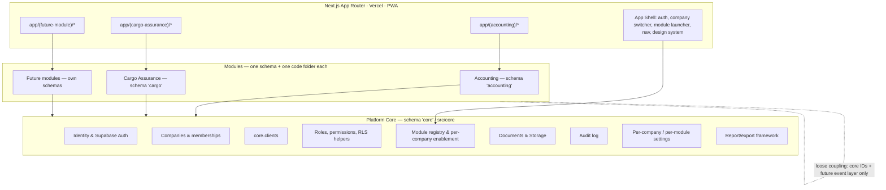

# Platform Module Framework

**TEAL Enterprise — Platform Core**
**Owning agent:** Orchestrator Agent
**Status:** Draft v1 — 2026-06-17

> Purpose: This is the most important infrastructure document in TEAL Enterprise. It defines how the
> **platform core** hosts **many independent modules** (Accounting first, Cargo Assurance second, more
> to come) so that adding the Nth module is a well-defined, repeatable operation rather than a
> bespoke project. It specifies the shared services the core provides, the contract every module must
> satisfy, the declarative module manifest, the database/security/UI conventions modules reuse, and a
> step-by-step "add a new module" playbook. Read this before building any module.

Related: [_ARCHITECTURE-SPEC.md](_ARCHITECTURE-SPEC.md) (authoritative names/types),
[teal-enterprise-platform-vision.md](teal-enterprise-platform-vision.md) (why),
[security-and-permissions.md](security-and-permissions.md) (RLS/RBAC),
[cargo-assurance/_CARGO-SPEC.md](cargo-assurance/_CARGO-SPEC.md) (module #2, the worked example).

---

## 1. Philosophy

TEAL Enterprise is **a platform of modules**, not a monolith and not a folder of separate apps.

- **One core, many modules.** A single shared core owns identity, tenancy, clients, permissions,
  documents, audit, settings, navigation, and the design system. Each module owns one business
  domain (accounting, cargo assurance, survey, claims, …).
- **Loose coupling.** A module depends on the **core**, never on another module's internals. Modules
  integrate with each other only through core-owned identifiers (companies, clients, users) and, in
  future, a published integration/event layer — never by importing another module's code or adding a
  foreign key into another module's schema.
- **Declarative registration.** A module describes itself with a **manifest** (key, route,
  navigation, permissions, settings). The core consumes manifests to build navigation, gate routes,
  seed permissions, and render the module launcher. Adding a module is mostly declaring it.
- **Schema isolation.** Every module lives in its own Postgres schema (`accounting`, `cargo`, …) and
  its own code folder (`src/modules/<key>/`). The core lives in `core` / `src/core/`.
- **Uniform security.** Every module reuses the same RLS helpers (`core.user_companies()`,
  `core.has_permission()`), the same audit trail, and the same multi-tenant guarantees.

The test of this framework: a competent engineer can add a new module by following §9 without editing
another module's code, and tenants can enable/disable modules per company without code changes.

## 2. Layered architecture



Three layers: **UI shell** (one app, module route-groups), **Core services** (shared), **Modules**
(isolated domains). Arrows point downward only — modules call the core; the core never imports a
module; modules never import each other.

## 3. What the Core provides to every module (the platform services contract)

Every module may rely on these and must not reimplement them:

| Service | Core surface | What a module gets |
| --- | --- | --- |
| **Identity & Auth** | Supabase Auth, `core.users` | Authenticated user (`auth.uid()`), profile, super-admin flag. |
| **Tenancy** | `core.companies`, `core.company_memberships` | The active company context and per-company role; the `company_id` every row is scoped by. |
| **Clients** | `core.clients` | Shared customer/contact identity used across modules (the same ExxonMobil row in Accounting and Cargo Assurance). |
| **RBAC & RLS** | `core.permissions`, `core.role_permissions`, `core.roles`, helpers `core.user_companies()`, `core.has_permission(company_id, key)` | Data-driven permissions and ready-made policy predicates. |
| **Module registry** | `core.modules`, `core.company_modules` | Registration and per-company enable/disable + `settings jsonb`. |
| **Documents & Storage** | `core.documents`, Supabase Storage buckets | A place to register files with `owner_module`, plus tenant-scoped storage. |
| **Audit** | `core.audit_logs` (+ trigger helper) | Append-only audit with `entity_schema` = the module schema. |
| **Settings** | `core.company_modules.settings` (+ module settings schema in the manifest) | Typed per-company module configuration. |
| **Reporting/export** | report/export conventions (`*_exports` tables + Storage) | A uniform way to generate PDF/CSV/Excel artifacts. |
| **UI shell & design system** | App shell, company switcher, module launcher, navigation, shared components/tokens | Consistent look, navigation, and route guarding. |

## 4. The Module Contract — what every module MUST provide

A module is complete when it provides all of the following, and nothing more is required of the core:

1. **A manifest** (`src/core/modules/manifests/<key>.ts`) implementing `ModuleManifest` (§5): key,
   name, description, route, navigation items, permission definitions, optional settings schema,
   enablement defaults.
2. **A registry entry** — the manifest is added to `src/core/modules/registry.ts` and the module is
   inserted into `core.modules` in the seed.
3. **Its own Postgres schema** (`<key_schema>`), created by numbered migrations that never alter
   another module's schema. All tenant tables carry `company_id` and follow the naming/type
   conventions in `_ARCHITECTURE-SPEC.md`.
4. **RLS on every table**, written with the core helpers (`core.user_companies()`,
   `core.has_permission()`), plus any module-specific access pattern (e.g. the Cargo client portal)
   layered on top — never weakening tenant isolation.
5. **Permission registration** — the module's permission keys (category = the module key) are seeded
   into `core.permissions` and granted to the relevant system/module roles in the seed.
6. **Audit coverage** — state-changing tables get the shared audit trigger (or explicit audit
   writes) with `entity_schema = '<key_schema>'`.
7. **Code under `src/modules/<key>/`** — domain logic, data access, and (where applicable) a versioned
   rules/calculation service. No imports from another module's folder.
8. **Routes under `app/(<key>)/`** — a Next.js route group; route access mirrors the manifest
   permissions (UI gate) on top of RLS (authoritative gate).
9. **Docs** — a module spec + supporting architecture docs under `docs/<key>/`, conforming to the
   document conventions.

## 5. The Module Manifest (declarative integration)

The manifest is how a module plugs into the shell and the registry without the core knowing module
internals. The TypeScript contract lives in `src/core/modules/types.ts`; concrete manifests live in
`src/core/modules/manifests/`. Shape:

```ts
interface ModuleManifest {
  key: string;                 // 'accounting' | 'cargo_assurance' | ...
  name: string;                // 'Accounting'
  tagline: string;             // launcher subtitle
  description: string;
  route: string;               // '/accounting' | '/cargo-assurance'
  schema: string;              // Postgres schema name: 'accounting' | 'cargo'
  status: 'live' | 'beta' | 'planned';
  icon?: string;
  navigation: NavItem[];       // sidebar/top nav for the module
  permissions: ModulePermission[];  // permission catalogue (seeded into core.permissions)
  settings?: ModuleSettingField[];  // typed per-company settings (stored in company_modules.settings)
  enabledByDefault?: boolean;
}
```

The core consumes manifests to:
- render the **module launcher** and the in-module **navigation**,
- **gate routes** (a route requires a permission key from the manifest; UI hides what the user can't
  do — RLS still enforces it server-side),
- **seed/verify permissions** (the manifest is the source list the DB seed mirrors),
- show the module only where `core.company_modules.enabled = true` for the active company,
- render **settings** forms from the typed settings schema.

Manifests are **pure data/TypeScript** — they require no database and can be reviewed and unit-tested
without Supabase. This is deliberate: the integration backbone is verifiable today, even while the DB
is blocked.

## 6. Database conventions for modules

- **Schema per module.** `accounting`, `cargo`, then `survey`, `claims`, … Exposed to PostgREST.
- **Tenant scoping.** Every business table: `company_id uuid not null references core.companies(id)`.
- **Cross-schema references:** modules may reference **core** tables (`core.companies`,
  `core.clients`, `core.users`) by foreign key. Modules **must not** foreign-key into **another
  module's** schema. If module B needs module A's data, it references the shared **core** identifier
  (e.g. both reference the same `core.clients.id`) or, later, consumes a published interface/event.
- **Naming/types.** UUID PKs, `numeric(20,4)` money/quantities, `created_at/updated_at`,
  `created_by/updated_by`, native enum types in the module schema. See `_ARCHITECTURE-SPEC.md` §4.
- **Migrations ordering.** Numbered globally (`0001…`). Core first, then each module's migrations.
  Current order: `0001_core_schema` → `0002_accounting_schema` → `0003_rls_and_helpers` →
  `0004_functions_posting` → `0005_cargo_schema` → `0006_cargo_rls` → (next module) … A module's
  migrations only create/alter its own schema (+ append its rows to shared seed data).
- **Derived data** (ledgers, aggregates) are views/functions in the module's schema, never duplicated
  into core.

## 7. Security model reuse

- **Tenant isolation (default for all modules):** a row is readable when its `company_id` is in
  `core.user_companies()`; writable when the user additionally has the required permission via
  `core.has_permission(company_id, key)`. Super admins bypass. Identical pattern in every module.
- **Per-module permissions:** keys namespaced by module (`accounting.*` style category; Cargo Assurance uses
  `cargo.*`). Seeded into `core.permissions`, granted to roles in the seed. Never hard-coded in app
  logic — the manifest declares them; the DB enforces them.
- **External / portal access (generalized pattern):** some modules expose read-only data to external
  parties (Cargo Assurance client viewers). This is modelled as an explicit access-grant table
  (e.g. `cargo.client_access(client_id, user_id, role)`) with its own additive RLS policies that
  **only widen read access to that party's own published data** and never broaden tenant data. This
  pattern is reusable by future modules (e.g. a claims portal). See
  [cargo-assurance/cargo-security-and-multitenancy.md](cargo-assurance/cargo-security-and-multitenancy.md).
- **Audit:** every module writes to `core.audit_logs` with `entity_schema` set to its schema, so the
  platform has one unified, queryable audit trail across all modules.

## 8. Module lifecycle

1. **Register** — manifest added to the registry + `core.modules` seed row + permissions seeded.
2. **Enable per company** — a `core.company_modules` row (`enabled = true`) turns the module on for a
   tenant; the launcher/nav show it only when enabled. Disabling hides it without deleting data.
3. **Configure** — per-company `settings jsonb` validated against the manifest settings schema.
4. **Operate** — users with the module's permissions use it; RLS enforces isolation.
5. **Evolve** — schema changes are new numbered migrations in the module's schema; manifests/permissions
   updated together; the seed stays the mirror of the manifest permission lists.
6. **Retire/Archive** — disable per company or mark the module `planned/archived`; data retained.

## 9. Playbook — adding a new module (the repeatable recipe)

Follow these steps in order. Cargo Assurance (`cargo_assurance`) is the worked example.

1. **Write the module spec** `docs/<key>/_<KEY>-SPEC.md` (canonical schema + principles), conforming
   to `_ARCHITECTURE-SPEC.md` and this framework. Add supporting docs under `docs/<key>/`.
2. **Author the manifest** `src/core/modules/manifests/<key>.ts` (key, route, schema, navigation,
   permissions, settings) and register it in `src/core/modules/registry.ts`.
3. **Add the DB schema** as numbered migrations: `00NN_<key>_schema.sql` (tables, enums, views) and
   `00NN_<key>_rls.sql` (RLS using core helpers + any portal access). Touch only the new schema.
4. **Seed reference + registration:** append to `supabase/seed/seed.sql` — a `core.modules` row, the
   module's `core.permissions` rows (category = `<key>`), and `core.role_permissions` grants for the
   module's roles. Add any module roles to `core.roles`.
5. **Mirror permission keys** in `src/core/<key or shared>/…` constants where the UI needs them.
6. **Build domain code** under `src/modules/<key>/` (data access + versioned calculation/rules where
   applicable). No cross-module imports.
7. **Build routes** under `app/(<key>)/`, gated by manifest permissions (UI) over RLS (server).
8. **Tests:** accounting/domain correctness + RLS cross-tenant isolation + (for portals) cross-client
   isolation, per `testing-strategy.md`.
9. **Update** `master-roadmap.md` and `HANDOFF.md`.

If a step requires editing another module's schema or code, stop — the design is wrong; route the
dependency through the core instead.

## 10. Inter-module integration & loose-coupling rules

- **Allowed now:** modules independently reference shared **core** entities (same company, same
  client). Example: Accounting invoices a client; Cargo Assurance reviews the same client — both use
  `core.clients.id`. No coupling between `accounting` and `cargo` schemas.
- **Planned (not a Phase-1 dependency):** a lightweight **integration/event layer** in core (an
  outbox/event table + typed contracts) lets module A publish a fact (e.g. "cargo-loss exposure
  finalized") that module B (Accounting) may consume to draft a transaction. Modules subscribe to
  **contracts**, not to each other's tables.
- **Forbidden:** importing another module's TypeScript, foreign-keying into another module's schema,
  or reading another module's tables directly. This keeps every module independently deployable,
  testable, and replaceable.

## 11. Module catalogue

| Module | key | schema | route | status |
| --- | --- | --- | --- | --- |
| Accounting | `accounting` | `accounting` | `/accounting` | live (foundation authored) |
| Cargo Assurance | `cargo_assurance` | `cargo` | `/cargo-assurance` | beta (foundation authored) |
| Survey Management | `survey` | `survey` | `/survey` | planned |
| Claims Management | `claims` | `claims` | `/claims` | planned |
| Cargo Monitoring | `cargo_monitoring` | `cargo_monitoring` | `/cargo-monitoring` | planned |
| Ship Agency | `ship_agency` | `ship_agency` | `/ship-agency` | planned |
| Freight Forwarding | `freight` | `freight` | `/freight` | planned |
| Compliance | `compliance` | `compliance` | `/compliance` | planned |
| Document Management | `documents` | `documents` | `/documents` | planned |
| Reporting & Analytics | `reporting` | `reporting` | `/reporting` | planned |
| Administration | `administration` | `core` | `/admin` | platform |

## 12. Open Questions

- **Event/integration layer timing:** when is the first real cross-module integration needed
  (Cargo Assurance→Accounting cargo-loss exposure?), and should the outbox/event contracts be built then or pre-emptively?
- **Manifest/DB drift:** do we enforce manifest↔`core.permissions` parity with an automated check in CI?
- **External identity:** do client-portal (external) users live in the same Supabase Auth pool with a
  flag, or a separate auth context? (Security doc to decide; default: same pool, access-grant table + RLS.)
- **Per-module storage buckets:** one shared tenant bucket vs a bucket per module — finalize with the
  Storage hardening section of `security-and-permissions.md`.

## 13. Decisions Locked

- TEAL Enterprise is a **platform of modules**: one core, schema-per-module, code-folder-per-module.
- Modules integrate via a **declarative manifest** consumed by the core; the core never depends on a
  module.
- **Loose coupling is mandatory**: modules reference core identifiers only; no cross-module schema FKs
  or code imports; future inter-module needs go through a core event/contract layer.
- Security, audit, tenancy, clients, documents, and reporting are **core services reused by every
  module**, with a reusable external-portal access pattern for read-only client access.
- Adding a module follows the §9 playbook; Cargo Assurance is the second module proving the framework.
