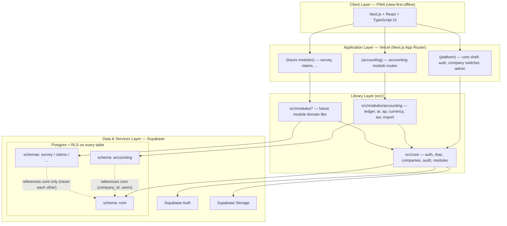

# TEAL Enterprise — Platform Vision

**TEAL Enterprise — Accounting Module** (platform-level vision document)
Owning agent: Orchestrator Agent
Status: `Draft v1 — 2026-06-17`

**Purpose.** This document defines the long-term vision for TEAL Enterprise as a modular business
operating platform for the Taylor group of companies in Trinidad & Tobago. It establishes the
shared-core + loosely-coupled-module architecture, the module boundary rules, the Postgres schema
separation strategy, and the platform-level conventions that every current and future module must
conform to. It does not contain application code; it is authoritative on platform shape and
subordinate to `_ARCHITECTURE-SPEC.md` on any conflicting cross-cutting detail.

---

## 1. The long-term vision

TEAL Enterprise is a single, unified business operating platform for the **Taylor group** — a
family of companies operating across **maritime, logistics, surveying, claims, ship agency, freight
forwarding, and accounting**, primarily in **Trinidad & Tobago**. Today these business lines are
served by disconnected spreadsheets, point solutions, and manual handoffs. The vision is to replace
that fragmentation with one platform where every company in the group shares a common identity,
security, document, and audit substrate, while each operational discipline is delivered as a
self-contained, independently evolvable **module**.

The guiding imperative — stated in `_ARCHITECTURE-SPEC.md` §1 — is **a shared platform core plus
loosely-coupled modules.** The core (TEAL Enterprise Core) owns the things every business line needs
in common: who the user is, which company they are acting for, what they are permitted to do, what
documents and audit history exist. Each module (Accounting first) owns its own domain logic, its own
Postgres schema, and its own routes, and integrates with siblings *only* through the core and through
explicit, versioned service boundaries — never by reaching into another module's tables.

This produces a platform that can grow one discipline at a time without destabilising the others. A
new module (e.g. Survey Management) can be built, enabled per-company, and retired without touching
Accounting internals. The group gets a coherent operating system; each module team gets autonomy.

### Why this matters for the Taylor group

- **One source of truth for identity, companies, and documents.** A surveyor, an accountant, and a
  ship agent all act inside the same company registry, the same membership/role model, and the same
  document store.
- **Per-company module activation.** Not every company in the group runs every discipline. The
  module registry (`core.modules` + `core.company_modules`) lets the platform enable exactly the
  modules a given company needs.
- **Multi-company by construction.** The Taylor group is many legal entities. The platform is
  multi-company from the first table; there are **no single-company assumptions** anywhere
  (`_ARCHITECTURE-SPEC.md` §10).
- **Trinidad & Tobago fit.** TTD base currency, T&T fiscal-year semantics, and statutory tax
  concepts (VAT, withholding, corporation tax, PAYE, NIS, Health Surcharge) are first-class — but
  always configuration-driven, never hard-coded.

---

## 2. The future module list

TEAL Enterprise is delivered as a sequence of modules over the platform core. The full roadmap, per
`_ARCHITECTURE-SPEC.md` §1, is below. **Accounting is the first module**; the remainder are planned
and will be built on the same core after Accounting is stable.

| Module | Schema (planned) | Status | Summary |
|---|---|---|---|
| **Accounting** | `accounting` | **Building first** | Double-entry general ledger, AR, AP, multi-currency, tax codes, periods, imports, reporting foundation. |
| Survey Management | `survey` | Planned | Marine/cargo survey jobs, inspections, findings, survey reports, certificates. |
| Claims Management | `claims` | Planned | Insurance/cargo claims intake, adjusting, reserves, recoveries, settlement. |
| Cargo Monitoring | `cargo` | Planned | Shipment and cargo tracking, milestones, condition monitoring. |
| Ship Agency Operations | `ship_agency` | Planned | Port calls, disbursement accounts, husbandry, vessel scheduling. |
| Freight Forwarding | `freight` | Planned | Bookings, consolidations, house/master documents, forwarding workflows. |
| Compliance | `compliance` | Planned | Regulatory, statutory, and certification tracking and obligations. |
| Document Management | `docman` | Planned | Higher-order document workflows over the shared `core.documents` store. |
| Reporting & Analytics | `analytics` | Planned | Cross-module reporting and dashboards over real module data. |
| Administration | (`core`) | Planned | Platform administration surface; primarily core-resident. |

Module names, ordering, and schema intent must match `_ARCHITECTURE-SPEC.md`. Any addition or
rename to this list is an architecture-level decision recorded in **Decisions Locked** here and in
the spec.

### Why Accounting is built first

1. **It is the financial substrate every other discipline ultimately feeds.** Surveys generate
   invoices; claims generate payables and recoveries; ship agency generates disbursement accounts;
   freight forwarding generates billing. Building the ledger first means later modules integrate
   into a real, correct financial backbone instead of bolting accounting on afterward.
2. **It forces the hardest invariants early.** Double-entry, multi-currency base-equivalents,
   period locking, immutability of posted entries, and staged/validated imports
   (`_ARCHITECTURE-SPEC.md` §6, §8, §10) are the most demanding correctness constraints in the whole
   platform. Solving them first hardens the core patterns (RLS, audit, company scoping) under real
   pressure.
3. **It delivers immediate group-wide value.** Every company in the Taylor group needs books.
   Accounting is the one module with universal demand, so it is the natural beachhead.
4. **It validates the boundary discipline.** Building Accounting as a strictly bounded module —
   integrating only through the core — proves the module-boundary rules before a second module
   exists to be coupled to.

Non-negotiable sequencing from `_ARCHITECTURE-SPEC.md` §10: **no reports before the ledger exists,
no dashboards before real accounting data exists.** Accounting-first is therefore not only
strategic but a hard ordering constraint.

---

## 3. Shared-core + loosely-coupled-module architecture

### 3.1 Two halves of every running system

```
TEAL Enterprise
├── TEAL Enterprise Core   (schema: core)   — identity, companies, RBAC, documents, audit, registry
└── Modules                                  — each its own schema + domain logic + routes
    └── Accounting Module  (schema: accounting) — the first module
```

- **TEAL Enterprise Core** is the platform. It is module-agnostic. It knows nothing about journals,
  invoices, surveys, or claims. It owns: authentication, users, companies, roles/permissions,
  memberships, platform-level clients/contacts, the shared document store, the audit log, and the
  **module registry**.
- **The Accounting Module** is the first business module. It owns the `accounting` schema and all
  domain logic: chart of accounts, the double-entry ledger, AR, AP, currencies, tax, periods,
  imports, and the reporting/dashboard scaffolding listed in `_ARCHITECTURE-SPEC.md` §5.

### 3.2 The module boundary rules (binding)

These rules make modules loosely coupled. They are derived from `_ARCHITECTURE-SPEC.md` §1, §4, §7,
and §10.

1. **A module owns exactly one schema.** Accounting owns `accounting`; future modules own `survey`,
   `claims`, etc. The core owns `core`. No module creates objects in another module's schema.
2. **No cross-module table access.** A module never reads or writes another module's tables
   directly. Module A does not `SELECT … FROM moduleB.*`. Integration happens through the core or
   through an explicit module service interface — never by FK or query into a sibling's internals.
   This is the literal meaning of `_ARCHITECTURE-SPEC.md` §10: *"No accounting logic mixed into
   future modules."*
3. **Modules depend on the core, never on each other.** Allowed dependency direction is
   **module → core only**. The core never depends on a module. Two modules never depend on each
   other at the schema or library level.
4. **Shared entities live in the core.** Anything two or more modules must agree on — the company,
   the user, the role, the document, the audit record, the platform contact — is a **core entity**.
   It is defined once, in `core`, and referenced (read) by modules.
5. **Cross-module references are mediated.** When a module must point at something in another module
   (e.g. a Survey job that produced an Accounting invoice), the link is expressed through a core
   construct — the shared `core.documents` store, a registry-aware reference, or a published module
   service — **not** a raw foreign key from `survey` into `accounting`.
6. **Every tenant-scoped table carries `company_id`** referencing `core.companies(id)`
   (`_ARCHITECTURE-SPEC.md` §4). Company scoping is a platform-level invariant, not a per-module
   choice.
7. **RLS on every table** in every schema (`_ARCHITECTURE-SPEC.md` §4, §7). Modules reuse the
   core's RLS helper functions (`core.user_companies()`, `core.has_permission(...)`) rather than
   inventing their own access logic.
8. **Permissions are data-driven and core-owned.** Modules declare their permissions as rows in
   `core.permissions`; they never hard-code access rules in application logic
   (`_ARCHITECTURE-SPEC.md` §7, §10).

### 3.3 How future modules integrate via the core

A future module (illustrated with Survey Management) integrates **without ever coupling to
Accounting internals** as follows:

- **Identity & company context.** The module reads `core.companies`, `core.users`, and
  `core.company_memberships`. It acts inside the same company the user has switched into. It does
  not maintain its own user or company tables.
- **Authorization.** The module's screens and writes are gated by `core.has_permission(company_id,
  permission_key)` using permission keys the module registered in `core.permissions`. RLS policies
  on `survey.*` tables reuse `core.user_companies()` exactly as Accounting does.
- **Documents.** Survey reports, photos, and certificates are stored through the shared
  `core.documents` store, tagged with `owner_module = 'survey'` and `entity_type` / `entity_id`
  pointing at the module's own rows. The document store is module-agnostic by design (its
  `owner_module` column is the integration seam).
- **Audit.** Every significant module action writes to `core.audit_logs` with
  `entity_schema = 'survey'`. Audit is uniform across the platform; the core owns the log, modules
  contribute to it.
- **Module activation.** Survey appears in `core.modules`; it is turned on per-company via
  `core.company_modules` with module-specific `settings jsonb`. A company without the Survey module
  simply has no enabling row, and the module's routes/data are inert for it.
- **Financial integration (the key decoupling case).** When a survey job must produce a customer
  invoice, the Survey module **does not** insert into `accounting.invoices`. Instead, financial
  effects are requested through a **published Accounting service boundary** (an application-level
  interface the Accounting module exposes). Accounting performs its own posting, enforces its own
  double-entry invariants, and owns the resulting `accounting.*` rows. The link back to the survey
  job is recorded via the mediated reference pattern (rule 3.2.5), so neither side reaches into the
  other's schema. This keeps "no accounting logic mixed into future modules"
  (`_ARCHITECTURE-SPEC.md` §10) literally true: the only place that knows how to build a balanced
  journal entry is the Accounting module.

The result: future modules are **clients of the core** and **clients of published module services**,
never of another module's database.

---

## 4. Postgres schema separation strategy

Per `_ARCHITECTURE-SPEC.md` §4, schema boundaries are the primary mechanism for module isolation in
the database.

- **Two schemas exist now:** **`core`** (platform) and **`accounting`** (the first module). Both are
  exposed to PostgREST/Supabase.
- **Each future module gets its own schema:** `survey`, `claims`, `cargo`, `ship_agency`, `freight`,
  `compliance`, `docman`, `analytics`. A new module = a new schema. Administration is primarily
  core-resident.
- **Cross-schema references are constrained:**
  - Modules **may** reference `core` (e.g. `company_id uuid not null references core.companies(id)`;
    `created_by uuid references core.users(id)`). This is the sanctioned dependency direction.
  - The single sanctioned cross-module FK in the canonical Phase 1 schema is
    `core.companies.base_currency_code → accounting.currencies(code)`
    (`_ARCHITECTURE-SPEC.md` §5). This is a deliberate, spec-locked exception: currency is reference
    data the platform needs at the company level. It is documented as an Open Question below because
    it represents a core→module reference, which is otherwise disallowed by direction rule 3.2.3.
  - Modules **must not** create FKs into other modules' schemas. Inter-module links use the mediated
    reference pattern (§3.2, §3.3).
- **Schema-level conventions (all schemas):** `uuid` PKs defaulting to `gen_random_uuid()`;
  `created_at timestamptz default now()`, `updated_at timestamptz`; `created_by`/`updated_by`
  referencing `core.users(id)` where relevant; money as `numeric(20,4)` with transaction-currency
  **and** `base_*` equivalents; soft delete via `deleted_at` where recoverability is required;
  **RLS enabled on every table**; enums as native Postgres `enum` types by default
  (`_ARCHITECTURE-SPEC.md` §4).
- **The General Ledger is not a base table.** It is derived from posted `accounting.journal_lines`
  via the `accounting.general_ledger` view (`_ARCHITECTURE-SPEC.md` §5). This is the pattern future
  modules should emulate: derive aggregates from authoritative transactional tables rather than
  duplicating state.

---

## 5. High-level system architecture

### 5.1 Layers

- **Client / PWA layer.** Next.js (App Router) + React + TypeScript, delivered as an installable,
  offline-capable PWA. Offline is **view-first only** — no offline editing until sync rules are
  defined (`_ARCHITECTURE-SPEC.md` §2, §10).
- **Application layer (Vercel).** Next.js App Router on Vercel. Route groups separate the core shell
  from module routes: `(platform)` for auth, company switcher, and admin; `(accounting)` for the
  Accounting module; future modules add their own route groups. Server components and route handlers
  hold the application-level module service boundaries (§3.3).
- **Platform-core libraries (`src/core/`).** Auth, RBAC, companies, audit, and the module registry —
  shared by all modules.
- **Module libraries (`src/modules/accounting/`, …).** Domain logic per module: ledger, AR, AP,
  currency, tax, import for Accounting.
- **Data & services layer (Supabase).** Postgres (schemas `core`, `accounting`, future module
  schemas), Auth, Storage, and Row Level Security. RLS is the enforcement point for multi-company
  isolation and permission-gated writes (`_ARCHITECTURE-SPEC.md` §7).

### 5.2 Layered architecture diagram



The diagram encodes the boundary rules: every module library depends on `CoreLib`; module schemas
reference `core` only and never each other; RLS sits on every table in every schema.

---

## 6. Multi-company and multi-tenant philosophy

The Taylor group is many legal entities, and the platform is built for that from the first table.
There are **no single-company assumptions** (`_ARCHITECTURE-SPEC.md` §10).

- **Multi-company by construction.** `core.companies` is the tenant anchor. Every tenant-scoped row
  in every schema carries `company_id uuid not null references core.companies(id)`
  (`_ARCHITECTURE-SPEC.md` §4). A user belongs to companies through `core.company_memberships`, each
  membership carrying a role.
- **Company switching, not separate logins.** A single authenticated user can hold active
  memberships in several group companies and switch the active company context in the `(platform)`
  shell. Their permissions are resolved per active company via `core.has_permission(company_id,
  permission_key)`.
- **Isolation is enforced in the database.** Tenant isolation does not depend on application code
  remembering to filter. RLS policies on every table make a row readable only when the user has an
  `active` membership for that row's company, and writable only when their role additionally grants
  the relevant permission. **Super Admin** bypasses company scoping (`_ARCHITECTURE-SPEC.md` §7).
- **Per-company configuration.** Each company sets its own `base_currency_code` (default **TTD**),
  `fiscal_year_start_month`, `timezone` (default `America/Port_of_Spain`), and its own enabled
  modules and module settings via `core.company_modules` (`_ARCHITECTURE-SPEC.md` §5).
- **Tenancy model.** TEAL Enterprise is a **shared-database, shared-schema multi-tenant** system:
  one Supabase Postgres instance, schemas split by module (not by tenant), and tenant isolation
  enforced by `company_id` + RLS. This keeps cross-company group reporting feasible (for permitted
  Super Admin / group roles) while guaranteeing per-company isolation for everyone else.

---

## 7. Naming, versioning, and module-registry conventions

### 7.1 Naming

- **Schemas:** lowercase, one per module — `core`, `accounting`, then `survey`, `claims`, `cargo`,
  `ship_agency`, `freight`, `compliance`, `docman`, `analytics`. Schema name = module identity in
  the database.
- **Tables & columns:** `snake_case`, plural table names (`companies`, `journal_entries`,
  `invoice_lines`) matching the canonical names in `_ARCHITECTURE-SPEC.md` §5 exactly. Canonical
  names are authoritative — documents and migrations conform to them; they do not invent variants.
- **Module keys (registry):** short, stable, lowercase identifiers used in `core.modules.key` and as
  `owner_module` / `entity_schema` values — e.g. `accounting`, `survey`, `claims`. A module's
  registry key equals its schema name.
- **Permission keys:** data-driven values in `core.permissions.key`, namespaced by module so that
  module ownership is legible (e.g. an accounting permission is owned and seeded by the Accounting
  module). Never hard-coded in application logic (`_ARCHITECTURE-SPEC.md` §7, §10).
- **Route groups:** Next.js App Router groups named for the surface they serve — `(platform)` for
  the core shell, `(accounting)` for Accounting, and `(<module>)` for each future module
  (`_ARCHITECTURE-SPEC.md` §3).
- **Library paths:** core libraries under `src/core/`; module libraries under
  `src/modules/<module>/` (`_ARCHITECTURE-SPEC.md` §3).

### 7.2 Versioning

- **Documents** are versioned with the `Draft vN — YYYY-MM-DD` status convention from
  `_ARCHITECTURE-SPEC.md` §11. This vision document is `Draft v1 — 2026-06-17`.
- **Migrations** are **ordered SQL files** under `supabase/migrations/` and are append-only:
  schema changes are new forward migrations, never edits to applied ones
  (`_ARCHITECTURE-SPEC.md` §3). This mirrors the accounting principle that posted history is
  immutable and corrections are additive (`_ARCHITECTURE-SPEC.md` §6).
- **Modules** carry a registry identity (`core.modules`) and per-company enablement state. Module
  evolution is expressed through additive migrations to the module's own schema plus, where relevant,
  versioned changes to the module's published service boundary — never through breaking changes to
  the core or to sibling modules.

### 7.3 Module-registry conventions

The module registry is the platform's contract for what modules exist and which companies use them
(`_ARCHITECTURE-SPEC.md` §5):

- `core.modules(id, key, name, description)` — the canonical list of modules known to the platform.
  Each future module from §2 registers exactly one row here when introduced. `key` is the module's
  stable identifier and equals its schema name.
- `core.company_modules(company_id, module_id, enabled bool, settings jsonb)` — per-company
  activation and configuration. A module is active for a company only when an enabling row exists
  with `enabled = true`. Module-specific configuration lives in `settings jsonb`, keeping the
  registry schema-stable while allowing modules to carry their own settings.
- **Registry is the only place that enumerates modules.** Application code, navigation, and access
  decisions consult the registry; they do not maintain a parallel hard-coded module list.
- **`owner_module` / `entity_schema` tagging.** Shared core stores (`core.documents.owner_module`,
  `core.audit_logs.entity_schema`) use the module's registry key, so the core can attribute any
  document or audit record to its owning module without depending on that module's schema.

---

## 8. Glossary of platform terms

- **TEAL Enterprise** — the modular business operating platform for the Taylor group.
- **TEAL Enterprise Core (the core)** — the module-agnostic platform layer owning identity,
  companies, RBAC, documents, audit, and the module registry; schema `core`.
- **Module** — a self-contained business discipline (e.g. Accounting) owning exactly one Postgres
  schema, its own domain libraries, and its own route group; integrates only through the core and
  published service boundaries.
- **Accounting Module** — the first module; the double-entry financial backbone; schema
  `accounting`.
- **Module boundary** — the rule set (§3.2) that keeps modules loosely coupled: one schema per
  module, no cross-module table access, module→core dependency only.
- **Module registry** — `core.modules` + `core.company_modules`; the authoritative list of modules
  and their per-company activation/configuration.
- **Module key** — a module's stable lowercase identifier, equal to its schema name, used in the
  registry and in `owner_module` / `entity_schema` tags.
- **Core entity** — a shared entity defined once in `core` and referenced by modules (company, user,
  role, permission, membership, platform client, document, audit record).
- **Company** — a tenant: one legal entity in the Taylor group; the anchor for multi-company scoping
  (`core.companies`).
- **Company membership** — a user's `active`/`invited`/`suspended` association with a company,
  carrying a role (`core.company_memberships`).
- **Multi-company / multi-tenant** — the shared-database, shared-schema model where tenant isolation
  is enforced by `company_id` + RLS, with schemas split by module rather than by tenant.
- **Base currency** — a company's reporting currency (default TTD); every monetary amount is stored
  in transaction currency and base-currency equivalent.
- **Published module service boundary** — the application-level interface a module exposes so other
  modules can request effects (e.g. Accounting posting an invoice) without touching its schema.
- **Mediated reference** — a cross-module link expressed through a core construct (documents,
  registry-aware reference, or a service), never a raw inter-module foreign key.
- **PWA (view-first offline)** — the installable, offline-readable client; no offline editing until
  sync rules are defined.

---

## Open Questions

1. **Core→module currency reference.** The spec-locked FK
   `core.companies.base_currency_code → accounting.currencies(code)` (`_ARCHITECTURE-SPEC.md` §5)
   makes the core reference the Accounting module, which inverts the module→core-only dependency
   direction (§3.2.3). Should currency reference data be promoted to a core-owned table (e.g.
   `core.currencies`) before further modules need currency, or remain an accepted exception?
2. **Published module service boundary shape.** What is the concrete, versioned form of an
   inter-module service call (e.g. Survey requesting an Accounting invoice) — in-process library
   contract, internal API, or event/outbox? This must be settled before the second module is built.
3. **Mediated cross-module references at the data layer.** What is the canonical representation of a
   "this survey job produced that invoice" link given the no-cross-module-FK rule — a core
   reference table, a typed reference on `core.documents`, or a registry-aware linking table?
4. **Group-level reporting roles.** The multi-tenant model supports cross-company reporting for
   Super Admin; do we need an additional permissioned "group reporting" role short of Super Admin,
   and how does RLS express it without weakening per-company isolation?
5. **Per-company module data lifecycle.** When a module is disabled for a company via
   `core.company_modules`, what is the defined behaviour for that company's existing module data
   (retain/inert vs. archive)?

## Decisions Locked

1. **Shared-core + loosely-coupled-module architecture is the platform shape.** TEAL Enterprise Core
   is module-agnostic; modules own their domain. (`_ARCHITECTURE-SPEC.md` §1)
2. **Accounting is the first module** and is built before any reporting or dashboards exist.
   (`_ARCHITECTURE-SPEC.md` §1, §10)
3. **One Postgres schema per module.** `core` and `accounting` exist now; each future module gets its
   own schema. (`_ARCHITECTURE-SPEC.md` §4)
4. **Module dependency direction is module→core only.** No cross-module table access; modules never
   depend on each other; shared entities live in the core. (`_ARCHITECTURE-SPEC.md` §1, §10)
5. **Multi-company by construction.** Every tenant-scoped table carries `company_id`; tenant
   isolation is enforced by RLS on every table. (`_ARCHITECTURE-SPEC.md` §4, §7)
6. **The module registry (`core.modules` + `core.company_modules`) is the authoritative module
   list and per-company activation mechanism.** (`_ARCHITECTURE-SPEC.md` §5)
7. **Tech stack is fixed:** Next.js App Router + React + TypeScript on Vercel; Supabase Postgres /
   Auth / Storage / RLS; PWA with view-first offline only. (`_ARCHITECTURE-SPEC.md` §2)
8. **Canonical names and conventions in `_ARCHITECTURE-SPEC.md` are authoritative**; this document
   conforms to them and does not introduce variants.

---

**Cross-references:** `_ARCHITECTURE-SPEC.md` (authoritative architecture spec). This document is the
platform-level vision; module-specific architecture docs (e.g. the Accounting Engine doc referenced
in `_ARCHITECTURE-SPEC.md` §4) are siblings and authoritative within their own scope.
